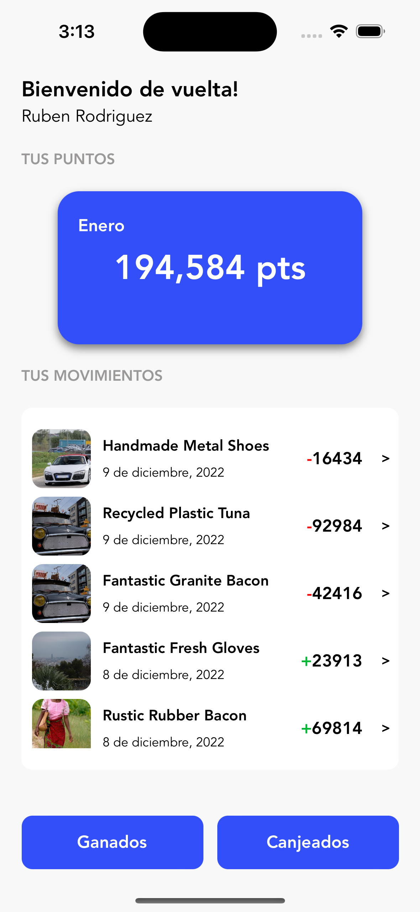
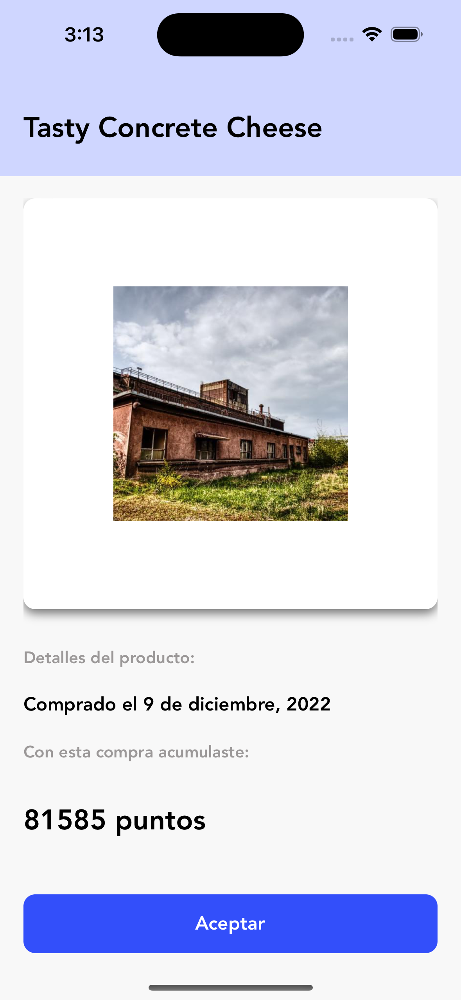
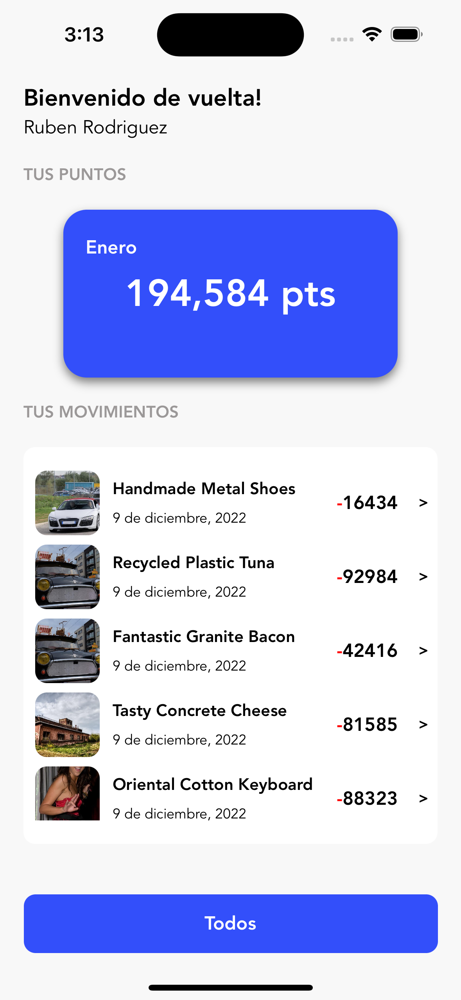
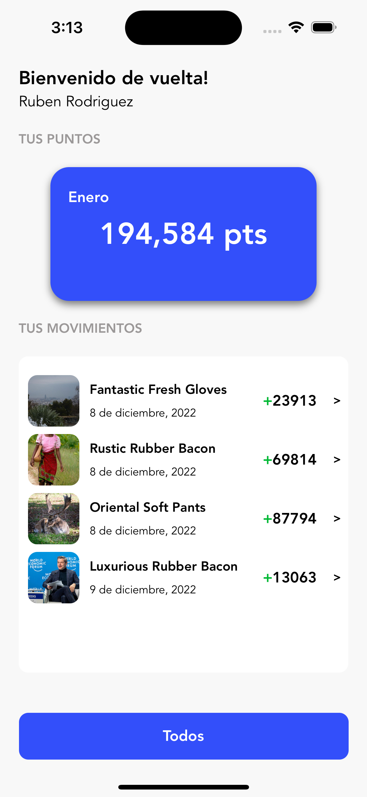

<div align="center">
<h1 align="center">Digital House</h3>
</div>

### Installation

1. Clone the repo

```sh
git clone git@github.com:naokisosa/digital-house-rn.git
```

2. Change Node version

```sh
nvm use
```

3. Install Yarn packages

```sh
yarn
```

4. Copy environment variables

```sh
cp .env.example .env
```

5. Install CocoaPods packages

```sh
npx pod-install
```

6. Run Metro Server

```sh
yarn start
```

7. Run on iPhone 14 Pro simulator

```sh
yarn run ios --simulator='iPhone 14 Pro'
```

<p align="right">(<a href="#top">back to top</a>)</p>

## Scripts

- Run test

```sh
yarn test
```

<p align="right">(<a href="#top">back to top</a>)</p>

## Screenshots

<div align="center">




</div>
<p align="right">(<a href="#top">back to top</a>)</p>
